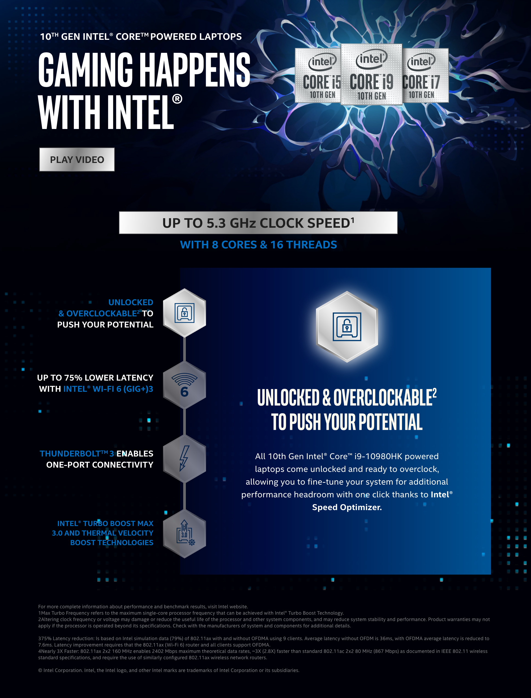

# Maquetando...

El ejercicio consiste en maquetar esta pequeña página. Se incluyen las imagenes exportadas, las tipografías, los textos y varios screenshots con el diseño.

## Entrega

23/10

## Detalle

* Breakpoints, la página es responsive entre 500px y 1000px. Menos de 500px se ve la barra de scroll y luego de 1000 el fondo blanco del body. Pero es importante que quede centrado. Entre el medio de los límites la página debe verse bien.
* Las tipografías e imagenes están incluidas en la carpeta assets. Tanto versión 500 como 1000.
* No utilizar ningún framework de css pero si es posible utilizar preprocesadores a elección. (si se utilizan preprocesadores incluir codigo fuente de ellos)
* El js debería ser el mínimo indispensable.
* Crear una rama y hacer push a esa rama. Luego armar un pull request en github y esperar el resultado.

## Vista

